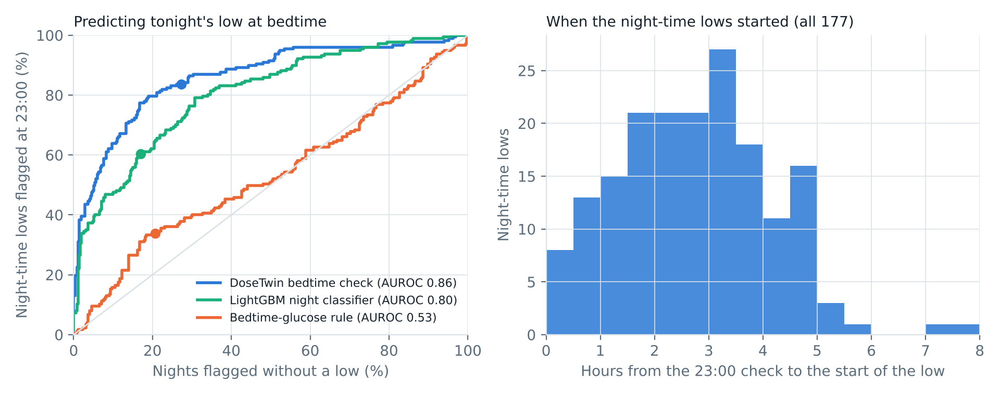
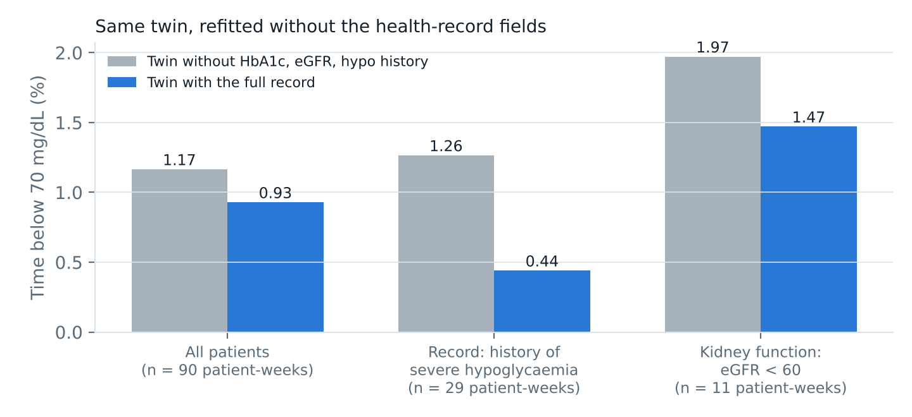

# DoseTwin

**Test the dose on your twin before you inject it.**

> Happiest Health Digital Twin Challenge 2026 · Phase 1 submission · Research prototype, evaluated in silico. Not a medical device.

| | |
|---|---|
| **Team** | Team Drafts |
| **Members** | Siva Sai Varshith Mitta (team leader) · Abhijith Jayan |
| **College / incubator** | Indian Institute of Technology (IIT) Goa · KL University, Hyderabad (inter-college team) |
| **Project title** | DoseTwin: a personal digital twin for insulin-treated diabetes |
| **Demo video (≥ 20 min)** | [unlisted YouTube link] |
| **Live demo (no install)** | https://varshith2403315.github.io/TeamDrafts_IITGoa/ · offline copy: [`web/dist/standalone.html`](web/dist/standalone.html) |
| **Architecture diagram** | [`docs/DoseTwin_architecture.pdf`](docs/DoseTwin_architecture.pdf) |
| **Presentation** | [`docs/DoseTwin_presentation.pdf`](docs/DoseTwin_presentation.pdf) |
| **Licence** | MIT ([`LICENSE`](LICENSE)) |

---

## Problem statement and healthcare use case

**Condition:** insulin-treated diabetes, **validated on type 1 diabetes (T1D)** on multiple daily injections. About 9.4 lakh people in India live with T1D, about 3 lakh of them aged 0–19 (IDF Diabetes Atlas, 2024). Nothing in the twin is specific to type 1: it uses insulin-pen doses, CGM, meals, wearables and the health record. People with type 2 diabetes on basal-bolus insulin are the next validation step; that use is not yet validated.

**Problem:** on insulin pens, every meal dose is a manual calculation, so errors are routine:
- carb counts are often off by 20–50%;
- clinic carb ratios drift between visits;
- activity and the early-morning rise go unaccounted.

The most feared adverse event is **hypoglycaemia**, especially at night, when people are asleep and cannot act on a warning. The affordable CGM sensors sold in India alert only after glucose is already low: FreeStyle Libre 2 Plus "does not have predictive glucose alarms" (Abbott support page). Sensors with predictive alerts cost roughly 2.5–3× more, and even they warn only about 30 minutes ahead.

**Use case:** DoseTwin builds a virtual replica of each patient from their health record and their CGM, smart-pen, meal-log, step, heart-rate and sleep data. It serves two users:
- **The patient** gets a meal dose that has been tested 5 hours ahead on their twin, an early warning before a low, and at **bedtime (23:00) a check of the whole night**: if the twin predicts a low, it suggests a bedtime snack sized so that its pessimistic night stays above 80 mg/dL.
- **The doctor** (clinician dashboard) sees patients ranked by hypoglycaemia risk including tonight's check, their record, wearables and glucose profile, the twin's forecast for tonight, and the settings the twin suggests. The doctor can change carb ratio, correction factor or basal dose and watch the virtual patient replay a real day under the new settings.

## Data fusion: the two streams

| Stream | Content | How it is used |
|---|---|---|
| **Static / historical (synthetic EHR)** | Demographics, diagnoses (ICD-10), labs (HbA1c, C-peptide, eGFR, TSH, LDL, urine ACR), genetic markers (HLA-DR genotype, GAD65), prescriptions | Weight and insulin prescriptions set the twin's starting point. **HbA1c** sets its fasting glucose (ADAG relation). **eGFR** raises its insulin potency, because failing kidneys clear insulin more slowly. **History of severe hypoglycaemia** (E16.0) raises the dose-safety floor from 70 to 80 mg/dL and moves low alerts and the bedtime check 7 mg/dL earlier. Thyroid, coeliac, genetics and the other labs are shown to the clinician only. ([`dosetwin/ehr.py`](dosetwin/ehr.py); records in `results/ehr_records_seed*.json`) |
| **Dynamic / real-time (synthetic wearables)** | CGM every 5 min (Dexcom-like error model), insulin-pen doses, meal log, step count, heart rate every minute, nightly sleep (duration, awakenings) | Personalises and synchronises the twin; drives forecasts, alerts, dose advice and the bedtime check. Heart rate catches exercise the step counter misses (cycling, gym, yoga); last night's sleep debt lowers the twin's insulin sensitivity for the day ([`dosetwin/fusion.py`](dosetwin/fusion.py)) |

All data is synthetic, as the challenge's data rules require. Ground-truth patients come from the published UVA/Padova type 1 model, which we extended so that kidney function, hypoglycaemia awareness and sleep have real physiological effects. The record reflects them imperfectly: eGFR carries lab noise, and the severe-hypo diagnosis is recorded for about 90% of patients with impaired awareness and 4% of others.

## Results (held-out, in silico)

30 virtual patients (10 children, 10 adolescents, 10 adults) × 3 fresh cohorts = **90 patient-weeks and 529 nights**. Nothing was tuned on these cohorts. All arms replay identical days: same meals, carb-counting errors, exercise, sleep and sensor noise. Statistics are paired per patient, with 5,000-sample bootstrap 95% CIs and Wilcoxon signed-rank tests (n = 30). "DoseTwin" below is the full system: twin dosing, twin + trend low alerts and the bedtime check.


| DoseTwin compared with | Time in range 70–180 | Time below 70 | Night-time below 70 |
|---|---|---|---|
| **Threshold-alarm CGM + bolus calculator** (affordable standard) | **+4.6 pts** (95% CI 2.1 to 7.5, p < 0.001) | **3.43% → 0.79%** (−77%, p < 0.001) | **7.20% → 1.19%** (−83%, p < 0.001) |
| Predictive-alert CGM + bolus calculator (premium) | +2.8 pts (−0.2 to 6.2, p = 0.05) | 1.06% → 0.79% (p = 0.11) | 1.78% → 1.19% (p = 0.08) |

### 1. Predicting tonight's low at bedtime

At 23:00 the twin simulates the night to 07:00 (nominal and pessimistic paths) and flags a likely low. Evaluated on 529 held-out nights on standard care, 177 of which had a low (< 70 mg/dL for ≥ 15 min).

| Bedtime predictor | AUROC (95% CI) | Lows flagged | Safe nights flagged |
|---|---|---|---|
| **DoseTwin bedtime check** | **0.86** (0.82–0.90) | **84%** | 27% |
| LightGBM night classifier (same inputs, trained on 354 dev nights) | 0.80 (0.75–0.85) | 61% | 17% |
| Bedtime-glucose rule (CGM < 127 mg/dL at 23:00) | 0.53 (0.44–0.61) | 34% | 21% |

The twin's AUROC is higher than LightGBM's by 0.06 (paired patient bootstrap 95% CI 0.01 to 0.11). Operating points were frozen on the development cohort at 80% specificity. **The warning comes a median 2.5 h before the low starts** (middle half 1.6–3.5 h), versus about half an hour for a CGM trend alert, and it comes before the person falls asleep. Acting on it (a twin-sized snack, eaten 80% of the time) cut night-time below 70 from 1.63% to 1.19% (−27%, p = 0.03) and night lows from 0.90 to 0.71 per patient over 6 nights (p = 0.04), for 2.5 snacks per patient per week and +0.23 pts of time above 250 (p < 0.001).



### 2. The health record measurably matters

We refitted every twin without HbA1c, eGFR and the severe-hypo diagnosis and re-ran the evaluation week.

| Same twin | Time below 70 | Below 54 | Night-time below 70 | Night lows / 6 nights | Time in range |
|---|---|---|---|---|---|
| Without the record fields | 1.17% | 0.06% | 2.05% | 1.10 | 82.3% |
| **With the record fields** | **0.93%** (−20%, p = 0.01) | **0.05%** (p = 0.04) | **1.63%** (p = 0.04) | **0.90** (p = 0.04) | 81.0% (−1.3 pts, p < 0.001) |

The effect is concentrated where the record says it should be: in patient-weeks whose record carries a history of severe hypoglycaemia (n = 29), time below 70 was 1.26% without the fields and 0.44% with them (night-time 2.33% → 0.68%); with eGFR below 60 (n = 11, small), 1.97% → 1.47%. The price is caution: 1.3 points of time in range.



### 3. Low alerts and forecasts

At ≤ 2 false alerts per patient per day, the hybrid alert caught **78%** of hypoglycaemia events, with a median warning of 26 min; a 30-minute CGM trend alert caught 75% and a LightGBM classifier 76% (LightGBM warns earlier, 41 min, and is better at ≤ 1 alert per day). The personal twin matches LightGBM at 30–60 min and is **more accurate when glucose is low**: 60-min RMSE 19.4 vs 23.6 mg/dL when true glucose is below 90. LightGBM is better at 2 h overall. Unlike LightGBM, the twin can answer "what if I take X units?" or "what if I go to bed now?", which dosing and the bedtime check need.


### What the results do not show

- **All patients are virtual, and validation is on type 1 only.** Behaviour and the extra physiology (sleep, kidney function, hypo awareness) are simulated, and the cohort is enriched for kidney disease and impaired awareness. Real-patient validation, then type 2 diabetes on insulin, are the next steps.
- **No 4–7 hour warning.** We hoped the bedtime check would warn 4–7 h ahead. Measured: median 2.5 h, because most night lows in this cohort start in the first 3–4 hours after bedtime. It also flags 27% of nights that stay safe.
- **Heart rate and sleep did not measurably help.** The twin recovered each patient's sleep sensitivity only weakly (rank correlation 0.18 with the truth). Without these streams, the bedtime AUROC was 0.87 vs 0.86 with them, and the 60-minute error after exercise the step counter misses changed only from 32.2 to 31.6 mg/dL. We keep the streams but claim no benefit.
- **Against premium CGM, gains are not significant at 0.05.** Most of the benefit comes from earlier warnings: low alerts during the day and the bedtime check at night.
- **The unpersonalised (record-only) twin is surprisingly safe.** It reached higher time in range (82.9% vs 81.0%) with similar lows, by dosing more and relying on 4.2 alerts and 59 g of rescue carbs per day (vs 2.9 alerts and 49 g for DoseTwin).
- **Twin-suggested settings are not better than the clinic's on average.** The twin's carb ratio was closer to the truth in 54% of patient-weeks, its correction factor in only 44%. The dashboard therefore limits changes to 20% per review and flags low confidence.
- **The cohort is easier than real life** (standard-care TIR ≈ 76%). Long-acting insulin is modelled as flat.

## Technical stack

Python 3.11 · NumPy · Numba (JIT for the twin) · SciPy (MAP fitting) · pandas · LightGBM and scikit-learn (baselines, ROC) · Matplotlib · Playwright (figure and PDF rendering) · vanilla JavaScript + SVG (dashboard, browser twin) · pytest · Docker.

## AI/ML model and framework details

```
 CGM (5 min) ──────┐
 Smart pen ────────┤                ┌──────────────────────────┐ ──► Predicted-low alert (twin + trend hybrid)
 Meal log ─────────┼──► Device ───► │  Personal twin           │
 Steps + heart rate┤    data        │  extended Bergman model  │ ──► Dose advisor (5 h what-if per dose)
 Sleep ────────────┘                │  + CGM observer          │
                                    └──────────▲───────────────┘ ──► Bedtime check (8 h night forecast, snack size)
 Synthetic EHR (weight, Rx, HbA1c, eGFR,       │                 ──► Clinician dashboard (tonight's risk, settings replay)
 severe-hypo history, ...) ──► EHR prior ──► MAP fit on 5-h forecasts (≈1.5 s / patient)
```

- **Twin model** ([`twin/model.py`](dosetwin/twin/model.py)): a 10-state extended Bergman minimal model. It has two-compartment subcutaneous insulin, two-compartment carb absorption, an activity term driven by steps fused with heart rate, insulin sensitivity that drops with last night's sleep debt, a dawn term, and an unexplained-rate state. Its structure is deliberately *different* from the hidden simulator.
- **Personalisation** ([`twin/identify.py`](dosetwin/twin/identify.py)): an EHR-informed prior (CF, CR, weight, basal, HbA1c, eGFR), then MAP estimation that minimises 5–300 min multi-step forecast error on the patient's own data, with a robust loss. The eGFR coefficient was estimated on the development cohort and frozen.
- **Synchronisation** ([`twin/tracker.py`](dosetwin/twin/tracker.py)): an observer locks the twin to every CGM reading.
- **Dose advisor** ([`twin/advisor.py`](dosetwin/twin/advisor.py)): simulates every half-unit dose for 5 h and rejects any dose whose pessimistic path (forecast minus a margin of 12 mg/dL per hour, capped at 25) dips below 70 mg/dL (80 with a history of severe hypoglycaemia). It then picks the lowest Kovatchev risk. Hard cap: 2× the calculator dose, +3 U.
- **Adverse-event prediction** ([`alerts.py`](dosetwin/alerts.py)): the mean of the twin's 40-minute forecast minimum and a 30-minute CGM trend projection; it alerts below 65 mg/dL (72 with a history of severe hypoglycaemia).
- **Bedtime check** ([`bedtime.py`](dosetwin/bedtime.py)): at 23:00, an 8-hour night forecast with nominal and pessimistic (+25% insulin sensitivity) paths; flags a low when the pessimistic minimum is below 84 mg/dL (threshold frozen on the dev cohort) and sizes a 10–30 g snack on the twin.
- **Baselines** ([`baselines.py`](dosetwin/baselines.py), [`bedtime.py`](dosetwin/bedtime.py)): LightGBM forecaster, low classifier and night classifier with the same inputs, including heart rate, sleep and the EHR fields.
- **Browser twin** ([`web/twin.js`](web/twin.js)): an exact port of the forward model (parity test < 1e-6 mg/dL). It powers the live dashboard.

Full method: [`docs/METHODS.md`](docs/METHODS.md). Decisions and trade-offs: [`docs/DECISIONS.md`](docs/DECISIONS.md).

## How it was evaluated

- **Hidden truth:** the open-source `simglucose` (MIT) UVA/Padova patients, re-implemented in vectorised form and parity-tested within 0.5 mg/dL of the original.
- **Realistic life over 14 days:**
  - Indian meal timing with late dinners;
  - carb counting with a personal bias plus 30% random error;
  - 10% missed and 12% late boluses;
  - mis-set clinic settings;
  - walks and other exercise, day-to-day sensitivity variation and a dawn effect;
  - sleep with short and broken nights that lower next-day insulin sensitivity (about 20% after a 4 h night, as reported by Donga et al., 2010);
  - reduced kidney function that slows insulin clearance, and impaired hypoglycaemia awareness that blunts counter-regulation;
  - night-time rescue only when the alarm wakes the patient;
  - CGM noise.
- **No leakage:** the twin sees only device and EHR data, and forecasts never use future inputs. All thresholds and the eGFR coefficient were frozen on a separate development cohort, where the baselines were also trained. Days 1–7 are standard care (fitting); days 8–14 are the paired evaluation. Ablations refit the twin rather than switching inputs off.

## Reproduce

```bash
pip install -r requirements.txt
python -m pytest -q                 # 17 tests: simulator parity, twin, advisor safety, EHR, JS parity
python scripts/run_study.py         # ~25 min on a laptop CPU -> results/
python scripts/make_figures.py      # -> docs/figures/
python scripts/export_demo.py       # -> web/demo_data.json   (meal-time view)
python scripts/export_clinic.py     # -> web/clinic_data.json (clinician view)
python scripts/build_web.py         # -> web/dist/index.html  (self-contained dashboard)
```

With Docker: `docker build -t dosetwin . && docker run --rm -v "$PWD/results:/app/results" dosetwin`.

## Repository map

```
dosetwin/truth/        hidden virtual patients (UVA/Padova + sleep, kidney, awareness) and the 14-day life simulator
dosetwin/ehr.py        synthetic EHR records (demographics, diagnoses, labs, genetics, Rx)
dosetwin/fusion.py     wearable fusion: steps + heart rate -> activity, sleep -> sleep debt
dosetwin/twin/         the digital twin: model, personalisation, tracker, dose advisor
dosetwin/alerts.py     predictive low alerts (trend, twin, hybrid)
dosetwin/bedtime.py    bedtime check: night forecast, snack size, night baselines
dosetwin/baselines.py  LightGBM baseline
scripts/               study, figures, data exports, web build
results/               every number in this README (CSV + JSON)
web/                   dashboard (twin.js = browser port of the twin)
docs/                  architecture PDF, presentation PDF, methods, decision log, video script
```

## Roadmap

1. Retrospective validation on real T1D CGM + insulin datasets under data-use agreements; then type 2 diabetes on insulin, where the same inputs exist.
2. Device connectors (CGM vendor APIs, smart-pen logs) and meal-photo carb estimates.
3. ABDM/FHIR integration for the clinician dashboard.
4. Prospective pilot with a paediatric diabetes clinic. Regulatory pathway as clinical decision support.

## Licence and credits

MIT. Ground-truth parameters and equations come from `simglucose` by Jinyu Xie (MIT), which implements the UVA/Padova T1DM simulator (Dalla Man et al. 2007; Kovatchev et al. 2009). CGM metrics follow the International Consensus on Time in Range (Battelino et al. 2019). The HbA1c–glucose relation is from Nathan et al. 2008 (ADAG).
