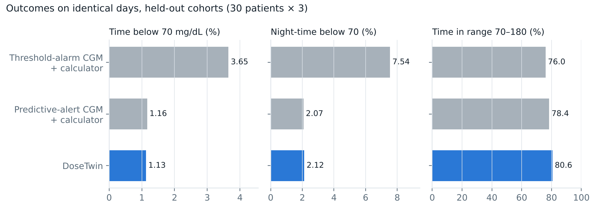
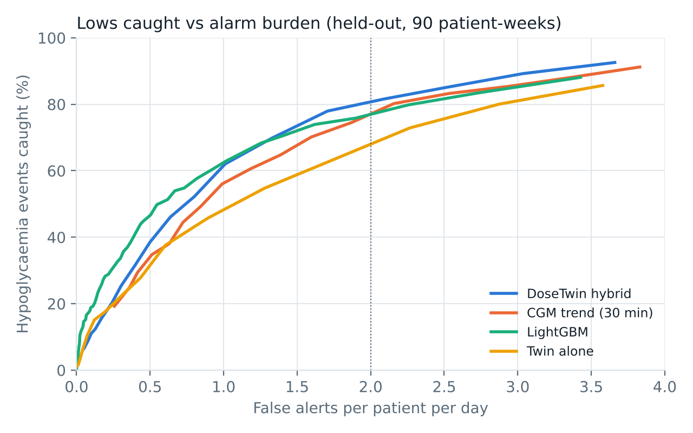
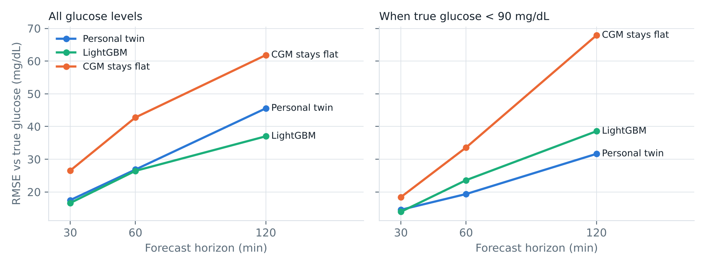

# DoseTwin

**Test the dose on your twin before you inject it.**

> Happiest Health Digital Twin Challenge 2026 · Phase 1 submission · Research prototype, evaluated in silico. Not a medical device.

| | |
|---|---|
| **Team** | Team Drafts |
| **Members** | Siva Sai Varshith Mitta (team leader) · Abhijith Jayan |
| **College / incubator** | Indian Institute of Technology (IIT) Goa · KL University, Hyderabad (inter-college team) |
| **Project title** | DoseTwin: a personal insulin-dosing digital twin for diabetes |
| **Demo video (≥ 20 min)** | [unlisted YouTube link] |
| **Live demo (no install)** | https://varshith2403315.github.io/TeamDrafts_IITGoa/ · offline copy: [`web/dist/standalone.html`](web/dist/standalone.html) |
| **Architecture diagram** | [`docs/DoseTwin_architecture.pdf`](docs/DoseTwin_architecture.pdf) |
| **Presentation** | [`docs/DoseTwin_presentation.pdf`](docs/DoseTwin_presentation.pdf) |
| **Licence** | MIT ([`LICENSE`](LICENSE)) |

---

## Problem statement and healthcare use case

**Condition:** insulin-treated diabetes, built and validated for **type 1 diabetes (T1D)** on multiple daily injections. About 9.4 lakh people in India live with T1D, about 3 lakh of them aged 0–19 (IDF Diabetes Atlas, 2024). The same method applies to the larger group of people with type 2 diabetes who use basal-bolus insulin; that use is not yet validated.

**Problem:** on insulin pens, every meal dose is a manual calculation, so errors are routine:
- carb counts are often off by 20–50%;
- clinic carb ratios drift between visits;
- activity and the early-morning rise go unaccounted.

The most feared adverse event is **hypoglycaemia**, especially at night. The affordable CGM sensors sold in India alert only after glucose is already low: FreeStyle Libre 2 Plus "does not have predictive glucose alarms" (Abbott support page). Sensors with predictive alerts cost roughly 2.5–3× more.

**Use case:** DoseTwin builds a virtual replica of each patient from their health record and their CGM, smart-pen, meal-log and phone step-count data. It serves two users:
- **The doctor** (clinician dashboard) sees patients ranked by hypoglycaemia risk, their record and glucose profile, and the settings the twin suggests. The doctor can change carb ratio, correction factor or basal dose and watch the virtual patient replay a real day under the new settings.
- **The patient** at mealtime gets a dose recommendation that has been tested 5 hours ahead on their twin, and an early warning before a low.

## Data fusion: the two streams

| Stream | Content | How it is used |
|---|---|---|
| **Static / historical (synthetic EHR)** | Demographics, diagnoses (ICD-10), labs (HbA1c, C-peptide, eGFR, TSH, LDL, urine ACR), genetic markers (HLA-DR genotype, GAD65), prescriptions | Weight, insulin prescriptions and **HbA1c** set the twin's prior (HbA1c → fasting glucose via the ADAG relation). The rest is shown to the clinician. ([`dosetwin/ehr.py`](dosetwin/ehr.py); records in `results/ehr_records_seed*.json`) |
| **Dynamic / real-time (synthetic wearables)** | CGM every 5 min (Dexcom-like error model), insulin-pen doses, meal log, phone step count | Personalises and synchronises the twin; drives forecasts, alerts and dose advice |

All data is synthetic, as the challenge's data rules require. Ground-truth patients come from the published UVA/Padova T1D model.

## Results (held-out, in silico)

30 virtual patients (10 children, 10 adolescents, 10 adults) × 3 fresh cohorts = **90 patient-weeks**. Nothing was tuned on these cohorts. All arms replay identical days: same meals, carb-counting errors, walks and sensor noise. Statistics are paired per patient, with 5,000-sample bootstrap 95% CIs and Wilcoxon signed-rank tests (n = 30).



| Comparison | Time in range 70–180 | Time below 70 | Night-time below 70 |
|---|---|---|---|
| **vs threshold-alarm CGM + bolus calculator** (affordable standard) | **+4.6 pts** (95% CI 2.9 to 6.4, p < 0.001) | **3.65% → 1.13%** (−69%, p < 0.001) | **7.5% → 2.1%** (−72%, p < 0.001) |
| vs predictive-alert CGM + bolus calculator (premium) | +2.2 pts (0.05 to 4.6, p = 0.13) | 1.16% → 1.13% (no difference) | 2.07% → 2.12% (no difference) |

**Predicting the adverse event.** At ≤ 2 false alerts per patient per day, the DoseTwin hybrid alert caught **80%** of hypoglycaemia events (≥ 15 min below 70 mg/dL), with a median warning of 26 min. A 30-minute CGM trend alert caught 71%, and a LightGBM classifier trained on 30 other patients caught 73%. LightGBM is slightly better at ≤ 1 alert per day and warns earlier.



**Forecasting.** The personal twin matches LightGBM at 30–60 min and is **more accurate when glucose is low**: 60-min RMSE is 19.9 vs 23.3 mg/dL when true glucose is below 90. LightGBM is better at 2 h overall. Unlike LightGBM, the twin can answer "what if I take X units?", which dosing needs.



### What the results do not show

- **All patients are virtual.** Behaviour is simulated. Real-patient validation is the next step.
- **The dosing gain over premium CGM is small and not significant.** Even perfect bolus adherence would add only about 2 TIR points in this cohort, so most of the measured benefit comes from earlier low warnings.
- **EHR fusion matters, and personalisation mainly cuts alarm burden.** Adding the HbA1c lab made an unpersonalised (EHR-only) twin fairly safe: time below 70 fell from 1.84% to 1.28% when we added it. Personalising on device data then cut alerts from 4.2 to 2.6 per day and rescue carbs from 61 to 41 g per day. The EHR-only twin reached higher TIR (82.9% vs 80.6%) by dosing more and relying on those alerts.
- **Twin-suggested settings are mixed.** The twin's carb ratio was closer to the truth than the clinic's in 53% of patient-weeks (median error 28% vs 37%). Some raw suggestions are clinically absurd (for example a basal of 0 U). The dashboard therefore limits changes to 20% per review and flags low confidence.
- **The cohort is easier than real life** (standard-care TIR ≈ 76%). Long-acting insulin is modelled as flat. Walking is the only exercise.

## Technical stack

Python 3.11 · NumPy · Numba (JIT for the twin) · SciPy (MAP fitting) · pandas · LightGBM (baseline) · Matplotlib · Playwright (figure and PDF rendering) · vanilla JavaScript + SVG (dashboard, browser twin) · pytest · Docker.

## AI/ML model and framework details

```
 CGM (5 min) ─┐
 Smart pen ───┤                ┌──────────────────────────┐
 Meal log ────┼──► Device ───► │  Personal twin           │ ──► Predicted-low alert (twin + trend hybrid)
 Phone steps ─┤    data        │  extended Bergman model  │
 Synthetic EHR┘                │  + CGM observer          │ ──► Dose advisor (5 h what-if per dose)
 (weight, Rx, HbA1c, ...)      └──────────▲───────────────┘ ──► Clinician dashboard (settings replay)
                       EHR prior ──► MAP fit on 5-h forecasts (≈1.3 s / patient)
```

- **Twin model** ([`twin/model.py`](dosetwin/twin/model.py)): a 10-state extended Bergman minimal model. It has two-compartment subcutaneous insulin, two-compartment carb absorption, an activity term driven by step count, a dawn term, and an unexplained-rate state. Its structure is deliberately *different* from the hidden simulator.
- **Personalisation** ([`twin/identify.py`](dosetwin/twin/identify.py)): an EHR-informed prior (CF, CR, weight, basal, HbA1c), then MAP estimation that minimises 5–300 min multi-step forecast error on the patient's own data, with a robust loss.
- **Synchronisation** ([`twin/tracker.py`](dosetwin/twin/tracker.py)): an observer locks the twin to every CGM reading.
- **Dose advisor** ([`twin/advisor.py`](dosetwin/twin/advisor.py)): simulates every half-unit dose for 5 h and rejects any dose whose pessimistic path (forecast minus a margin of 12 mg/dL per hour, capped at 25) dips below 70. It then picks the lowest Kovatchev risk. Hard cap: 2× the calculator dose, +3 U.
- **Adverse-event prediction** ([`alerts.py`](dosetwin/alerts.py)): the mean of the twin's 40-minute forecast minimum and a 30-minute CGM trend projection; it alerts below 65 mg/dL.
- **Baseline** ([`baselines.py`](dosetwin/baselines.py)): a LightGBM forecaster and classifier using the same EHR fields.
- **Browser twin** ([`web/twin.js`](web/twin.js)): an exact port of the forward model (parity test < 1e-6 mg/dL). It powers the live dashboard.

Full method: [`docs/METHODS.md`](docs/METHODS.md). Decisions and trade-offs: [`docs/DECISIONS.md`](docs/DECISIONS.md).

## How it was evaluated

- **Hidden truth:** the open-source `simglucose` (MIT) UVA/Padova patients, re-implemented in vectorised form and parity-tested within 0.5 mg/dL of the original.
- **Realistic life over 14 days:**
  - Indian meal timing with late dinners;
  - carb counting with a personal bias plus 30% random error;
  - 10% missed and 12% late boluses;
  - mis-set clinic settings;
  - walks, day-to-day sensitivity variation and a dawn effect;
  - night-time rescue only when the alarm wakes the patient;
  - CGM noise.
- **No leakage:** the twin sees only device and EHR data, and forecasts never use future inputs. All thresholds were frozen on a separate development cohort, where the baseline was also trained. Days 1–7 are standard care (fitting); days 8–14 are the paired evaluation.

## Reproduce

```bash
pip install -r requirements.txt
python -m pytest -q                 # 12 tests: simulator parity, twin, advisor safety, EHR, JS parity
python scripts/run_study.py         # ~15 min on a laptop CPU -> results/
python scripts/make_figures.py      # -> docs/figures/
python scripts/export_demo.py       # -> web/demo_data.json   (meal-time view)
python scripts/export_clinic.py     # -> web/clinic_data.json (clinician view)
python scripts/build_web.py         # -> web/dist/index.html  (self-contained dashboard)
```

With Docker: `docker build -t dosetwin . && docker run --rm -v "$PWD/results:/app/results" dosetwin`.

## Repository map

```
dosetwin/truth/        hidden virtual patients (UVA/Padova) and the 14-day life simulator
dosetwin/ehr.py        synthetic EHR records (demographics, diagnoses, labs, genetics, Rx)
dosetwin/twin/         the digital twin: model, personalisation, tracker, dose advisor
dosetwin/alerts.py     predictive low alerts (trend, twin, hybrid)
dosetwin/baselines.py  LightGBM baseline
scripts/               study, figures, data exports, web build
results/               every number in this README (CSV + JSON)
web/                   dashboard (twin.js = browser port of the twin)
docs/                  architecture PDF, presentation PDF, methods, decision log, video script
```

## Roadmap

1. Retrospective validation on real T1D CGM + insulin datasets under data-use agreements; then insulin-treated T2D.
2. Device connectors (CGM vendor APIs, smart-pen logs) and meal-photo carb estimates.
3. ABDM/FHIR integration for the clinician dashboard.
4. Prospective pilot with a paediatric diabetes clinic. Regulatory pathway as clinical decision support.

## Licence and credits

MIT. Ground-truth parameters and equations come from `simglucose` by Jinyu Xie (MIT), which implements the UVA/Padova T1DM simulator (Dalla Man et al. 2007; Kovatchev et al. 2009). CGM metrics follow the International Consensus on Time in Range (Battelino et al. 2019). The HbA1c–glucose relation is from Nathan et al. 2008 (ADAG).
